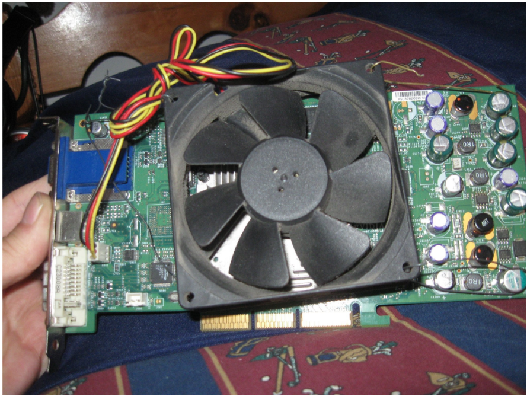

So... Mr. Da Kid has some issues with his video card and noticed the video 
card was kind of overheating and the PC was going offline. Well turns out 
the fan on the video card died and he only had a huge fan, but hey it works 
just fine so a round of applause's for actually getting it to work again!
